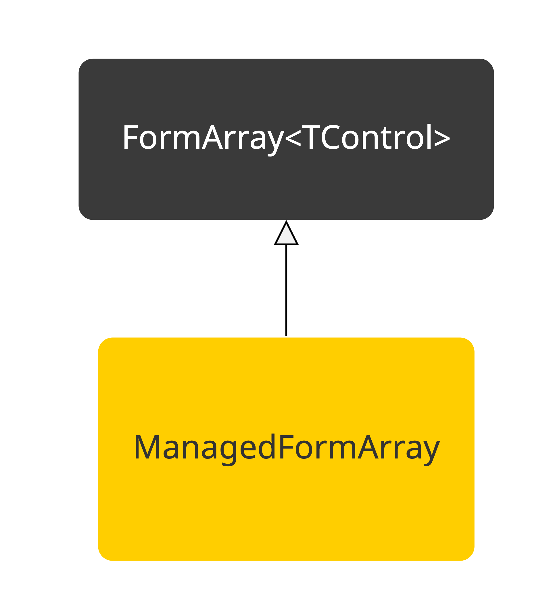

# ManagedFormArray

Ever struggled with managing complex Angular form arrays ? I did and quite a lot, mainly when you need to subscribe
to `valueChanges`
of the different `FormGroup` items. While having tried different solutions, none of them felt actually good.

So one day I was reading up on the `FormArray` subject in an attempt to figure out a better way to manage this and came
up with this concept.

The idea is to create an abstract class on top of the default Angular `FormArray` class. This abstraction manages the
creation of each `FormGroup`
inside the array, but besides that also makes it possible to get `valueChanges` of each individual `FormGroup`.

Following diagram represents the class structure:


# Create a ManagedArray

The `ManagedArray` class will behave the same as the default `FormArray` since it inherits from it. Only difference is
that it has a different constructor
which accepts 2 parameters:

- `destroy`: This should be a `Subject` which signals that the it everything should be cleaned up.
- `initialData`: An array that contains the initial objects from which a `FormGroup` needs to be created of. This
  parameter is an optional parameter and can also be left out.

Since the implementation is abstract it will require you to implement the `createForm` method. This method will create
a `FormGroup` out of a normal object.
It will also be called when passing initial data into the constructor.

# Using `MangedArray`

The base class has 2 methods:

- `addItem`: Add a new `FormGroup` to the array
- `removeItem`: Remove a `FormGroup` instance from the array.

# Listening for changes

`ManagedArray` exposes an observable called `groupChanges`, it will emit the `FormGroup` that got changed and has the
following structure:

```typescript
{
  form: T;
  index: number;
}
```

The `form` property is a reference to the `FormGroup` instance and index is the index number in the `FormArray`
